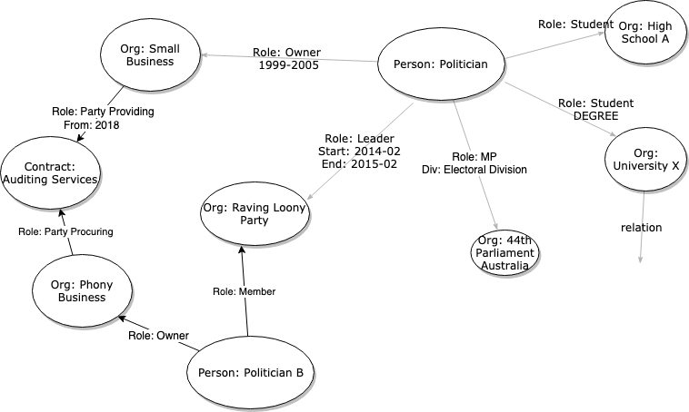

# GAME OF MATES - A Graph API / Data Service

## Why?

I'm an active Tweeter, in the #auspol twitter sphere	 - the most recent 2019 Australian election, an increasing sense of corruption and a disturbing global trend of rising authoritarianism is to my thoughts putting democracy and social progress at risk.

There is great work going on by journalists to find patterns in individual articles and cases, particularly the growth of citizen journalists and some work is faithfully created in Wikipedia entries as plain text... but what I would like to have is a public domain data set around this to tie things together as effectively a 'corruption sniffer' via exploring relationships and having a better 'memory of events' to ask questions of.

## How it could work?

This is definitely too big for one person, but I had an idea from the [Global Power Plant Database](https://github.com/wri/global-power-plant-database) and some of the Open source datasets becoming available.

The proposal would be to support as an Open source data collection - use GitHub issues to track contribution and evolve capability and coverage over time.

There will probalby need to be some scoping or isolation of size of the dataset for maintenance and scale purposes. 

An example would be People and key relationships linked to the Australian Federal Parliament from the year 2000 to current day.


### What is Open Source?

<blockquote>
The open-source model is a decentralised software development model that encourages open collaboration. A main principle of open-source software development is peer production, with products such as data, source code, blueprints, and documentation freely available to the public  * Wikipedia
</blockquote>

### Actions on the Data set 

The data set would evolve by the following types of changes over time:

 * Add Data / Relationships
 * Report inaccurate / obsolete data and fix
 * Enhancements (New Objects, Types, relationships)
 
 Persons particularly interested could ideally in a simple syntax describe a person or scenario they would like supported:
 
 * e.g. 'Feature Request:  Add 2019 #Watergate people & relationships'


## The Concept / Proposal

Graphs are a good way to semantic data and relationships, with potentially 'weighted' edges for navigation.

Typical questions that could possibly be quickly answered by Graph navigation:

* Which politicians in Parliament attended school at the same time?
* What companies are connected to politician X and donated to their party?
* What politicians have been past or are current members of Think Tank X?
* What politicians are linked to this criminal?
* What companies with related ex-politicians on the board won government procurement contracts?
* Which politicians were named in the Panama Papers and what organisations were they linked to?


## What is a Graph?

"A graph is a structure composed of vertices and edges. Both vertices and edges can have an arbitrary number of key/value-pairs called properties. "

"Edges denote relationships between vertices. For instance, a person may know another person, have been involved in an event, and/or was recently at a particular place"

## What is a Temporal Graph?

Temporal or.. Dynamic, Evolving, Time-Varying graphs are graphs that change with time, so can be thought of a special case of labelled graphs that change with time, where the labels capture some measure of time or effective date.

To effectively deal with a timeline of events like in the political world will need to deal with timing.

What we would propose are key date labels as a standard for nearly all edges;

`effectiveFromDate`
`effectiveToDate`

## What is a Graph API?

An API is an 'Application Programming Interface' that allows programs, software, people or machines to easily interact over the HTTPS / Web protocol.


A simplistic definition of a Graph API is an API that models the data in terms of nodes and edges (objects and relationships) and allows the client to interact with multiple nodes in a single request.

## What is the 'Semantic Web'?

Publishing this as a service / data set is effectively creating a 'Semantic web' project on this information.

When applied in the context of the modern internet, it extends the network of hyperlinked human-readable web pages or press articles by inserting machine-readable metadata about pages, things or resources in a model of the real world	 and how they are related to each other.

<blockquote>
"The Semantic Web provides a common framework that allows data to be shared and reused across application, enterprise, and community boundaries" - Wikipedia
</blockquote>

	

## Benefits

Rather than Files or Flat tables - a Graph can (it is submitted..) represent the murky political world more flexibly, relationships can be added , attributes extended as the real world changes.

"In a graph, each vertex is seen as an atomic entity (not simply a "row in a table") that can be linked to any other vertex or have properties added or removed at will"

## Example Graph

By collecting public domain information such as news articles, Wikipedia or FOI discovered documents a 'graph' of relationships and influence can potentially be created.

The 'Objects' can be related to people as interesting / beneficial to them - e.g. Contracts, Organisations, Assets.

The 'Edges' can be used to put context sensitive relationships between the Objects e.g. Politician A - {owned} business B {between 1995 and 1999}



### Relationships

Relationships in our Dataset graph are proposed to be represented in a notation that has been used for a while and is fairly native to our language.

In an 'RDF Triple' we talk about a subject, having a relationship to an Object via a 'Predicate' (Relationship).

subject: The thing we’re talking about. In RDF, this is the resource in question.

predicate: A term used to describe or modify some aspect of the subject. In RDF, the predicate is used to denote relationships between the subject and the object.

( FOAF spec as an idea for expressing these : http://xmlns.com/foaf/spec/ )

object: In English the object of a sentence is the thing that the verb is acting upon. In RDF, it’s the “target” or “value” of the triple. It can be another resource, or just a literal value such as a number or word.

In RDF URI's / URN's are used to uniquely identify resources so a key item in establishing our data set is accurately categorising our 'subjects' so we can then build the relationships between them.

Example from above:

```
# Person / Politician
{
   id: "urn:aec.gov.au/person/parliamentarians.rdf/poltician.x"
}

#Political Party
{
  id: "urn:aec.gov.au/person/parties.rdf/raving.loony.party",
  name: "Raving Loony Party"
}

# Politician 'X' Member of 'Raving Loony' Party
{
  subject: "urn:aec.gov.au/person/parliamentarians.rdf/poltician.x"
  predicate: "urn:aec.gov.au/relationsips/memberOf",
  object: "urn:aec.gov.au/person/parties.rdf/raving.loony.party"
  effectiveFrom: "2015-12-22",
  effectiveTo: "" // present
}

# Politician 'X' Member of parliament '45'
{
  subject: "urn:aec.gov.au/person/parliamentarians.rdf/poltician.x"
  predicate: "urn:aec.gov.au/relationsips/memberOf",
  object: "urn:aph.gov.au:parliament:45"
}
```

#### Hypermedia Relationships


### Principles

#### Principle 1: Open source / Inner source

Open data set, Ideally this is a public asset that can be used to aid democracy and increase insight.

Given it may have sensitivity controls on the change / commits and release process may need to be applied.

#### Principle 2: Focussed on current power base, but agnostic to Party / Politics

Open source means open source, all public domain or discovered / FOI information is relevant as corruption is agnostic to political parties. The current executive is the main impact on citizen's lives so data and relationships related to the power base of the current executive should be prioritised over an opposition for data maintenance when choosing between priorities of updates to the data set.

#### Principle 3: Enrich with other open data sets / aggregations

Use what else is out there Parliament reports, FOI requests, submissions, voting records, ABS stats, AEC results,  Donation records, .. link trusted sources in as required (avoid copying).

#### Principle 4: Open contribution, Attribution -  errors are remediated

Being an open data set, Issues can be raised for change or to correct the data set.

Links being made should always attempt to link to an Attribution of that data and relationship.  Each change should be reviewed by one other member of the team, ideally with a critical line of inquiry and to the level that it would be confidently represented if required in a legal proceeding or report.

Where changes occur rectifications or errors should be remediated and fixed as quickly as possible and clarified in release notes.

By using a version control system, it is always visible who has made changes to information.


#### Principle 5: Links over detailed text / context

The main content should be to capture real world people, things and relationships over a timeframe (temporal).  Where extra information is needed should use public Open data links to other sources rather than copying information into the dataset.

Because of the nature of integration, a careful consideration needs to be made in the stability and reliability of linked data URI's and resources as too many links that change frequently could lead to brittle information management.

## Current Resources (Vertexes / Nodes)

The definitions of each can be seen in the JSON specification [LoadableGraphSpec.json](./src/main/resources/LoadableGraphSpec.json)


### Countries 

ISO-3166 Countries, linked to Australia.
Commonwealth of Australia and territories.

```
id prefix: urn:iso:std:iso:3166:
label: country
```


### Provinces (Australia only)

ISO-3166-2 AU Provinces

All Australian states and territories

```
id prefix: urn:iso:std:iso:3166:-2:
label(s): province
```

### Australian Electoral Divisions

Federal electoral divisions

```
urn:aec.gov.au:division:
label: electoral_division
```


### Australian Parliaments

Historical Australian Parliaments.
ID's, names, dates of sitting.

```
id prefix: urn:aph.gov.au:parliament:
label: au_parliament
```


### Lobbying Organisations

Lobbying organisations registered with Australian AG's department.
Uses the ABN as an identifier.

```
id prefix: urn:lobbyists.ag.gov.au:
label: au_gov_lobbyists
```

## Proposed Resources


### PERSON

Identify political figures - starting with Politicians, key roles from parliament.

 Capture the minimum needed to identify a key actor that is already in the public domain (e.g. Wikipedia), on principle 
 
*No children or minors should be linked or added to the data set.*
 
 [Schema.org - Person](https://schema.org/Person)
##### identifier ( firstname.lastname.dob)
##### date of birth
##### location
##### (parents, siblings)
##### education
##### employment (roles)
##### memberships (Orgs)
##### life event(s)	
##### awards	
##### socialMedia

How to identify a Person? 
https://www.openownership.org/news/identity-and-identifiers-what-weve-learned/

ISO Standard (ISO 27729:2012) - ISNI
https://viaf.org/viaf/92625366/

 
	
### ORGANISATION

Suggest use ABN's as primary ID:

 --- abn
 -- inception
 -- type
 -- constitution
 -- registeredUnder (Act)
 -- category
 -- Governance

Prioritise Lobbying links, High value ASX, High value Proprietary, Media, Investment banks, Multinationals


https://asic.gov.au/online-services/#registerforonline

https://abr.business.gov.au/ABN/View?abn=70614363647

https://www.asx.com.au/asx/share-price-research/company/AOF/details


### Government Department

https://www.directory.gov.au/reports/australian-government-organisations-register


ROLE:
OFFICIAL
CORPORATION
CORPORATE OFFICER
POLICE OFFICER
INTELLIGENCE AGENCY
CONTRACT
CONTRACT-EXECUTION
COMMUNICATION
DIPLOMAT
PRESS RELEASE
REGULATION
LEGISLATION
ELECTION
CANDIDATE
LEGAL OFFICIAL
LAWYER
ACCOUNTANT
DOCTOR
UNION
CONSULTANCY
TAXHAVEN
CENSUS
JOURNALIST
ARTICLE-INTERVIEW
MEDIA-CHANNEL
CITIZEN
CELEBRITY
PRIEST
DEPARTMENT
GOVT Roles ( https://www.directory.gov.au/commonwealth-parliament )

## Physical World

```
* [COUNTRY](./src/main/resources/schemas/Country.json)
    * /[PROVINCE (State/Territory)](./src/main/resources/schemas/Province.json)/
       *  [Electoral Division](./src/main/resources/schemas/AU-ElectoralDivision.json)
           * /CITY
               * /SUBURB
               * /STREET
```
 * GEOLOC
 * SERVICE
 * PRODUCT
 * AUDIT_REVIEW
 * MINERAL_RESOURCE
 * WATER_RIGHT
 * BUILDING
 * FARM
 * OFFICE
 
 ### Geo-Referneces / RDF standards to consider
 
 https://ec.europa.eu/eurostat/ramon/index.cfm?TargetUrl=DSP_PUB_WELC
 http://www.geonames.org/ontology/documentation.html
 https://www.w3.org/2003/01/geo/


# Attributes
 * EFFECTIVE-DATE(S)
 * SOURCE-ATTRIBUTION
 * CONTEXT-Description
 * TAGS


## Relationships

 * FAMILY_RELATIVE
 * WORK_COLLEAGUE
 * SUBORDINATE / SUPERIOR
 * ASSOCIATE
 * SUBSIDUARY
 * ELECTORATE-DEMOGRAPHICSTAT
 
 ### Relationship RDF refernces to consider
 
 https://www.w3.org/TR/skos-reference/#L21181 - Simple knowledge organisation
 http://xmlns.com/foaf/spec/ - FOAF friend of a friend
 http://vocab.org/open/ - Open vocab terms

# ELECTORATE CENSUS

 * STATE_TERRITORY.ELECTORATE
 * SCHOOL
 * RELIGIOUS
 * ELECTORATE / BOOTH
 * POLICE STATION
 * ROAD
 * TRAIN STATION
 * AIRPORT
 * ELECTION COMMITMENT
 * POLICY
 * WEATHER_EVENT

#FINANCE

Time series based data sets to correlate - ideally borrow / link as many as possible

 * INFLATION / CPI
 * GDP
 * INTEREST_RATE ( Reserve, Commercial, CreditCard,..)
 * BOND
 * EQUITY / SHARE
 * CURRENCY
 * TRUST
 * NOT-FOR-PROFIT
 * ORG ( PTY_LTD, LTD, PRIVATE, ..)
 * INCOME
 * EXPENSE
 * PROFIT-LOSS
 * PROPERTY (HOUSE, UNIT, COMMERCIAL, INDUSTRIAL, LAND, PRIMARY, MINERAL)
 * UNIT_TRUST
 
 
# Publications, Media

Dublin core - for articles, publications, references

https://www.dublincore.org/specifications/dublin-core/dcmi-terms/2012-06-14/?v=elements
 
 
## Design Notations

### URN's

Amazon uses URN's [(Uniform Resource Names)](https://en.wikipedia.org/wiki/Uniform_Resource_Name) - it is submitted as a suitable pattern for identifiers.

It is used for linking, a primary key and identifiers.

`urn:{namespace}:{resourceType}:{resource-id}`

Examples:

`urn:aph.gov.au:election:2019-05-18` - Election on 18th May 2019
`urn:aph.gov.au:parliament:45` - 45th Parliament
`urn:aec.gov.au:division:macnamara` - Electoral division of Macnamara

### XMDP to ALPS

XMDP
Activity streams
Alps for html
Profile link relation
Alps stand alone


# References


Twitter - @DrCameronMurray

[gameofmates.com](https://gameofmates.com/)

[Bellingcat - Open source / Citizen journalism](https://www.bellingcat.com/)

[Tim Berner's lee - Guardian.com - Hunt for Journalism in Data sets](https://www.theguardian.com/media/2010/nov/22/data-analysis-tim-berners-lee)


## Technical References

Initial investigations focus on a Graph / JVM based technology. (Gremlin) and a resource linking framework (RDF / JSON-LD).

JSON or Protobuf... not sure;
[Google Protobuf](https://developers.google.com/protocol-buffers/)
[API's linked data](https://linkeddataorchestration.com/2014/02/24/data-modeling-for-apis-part-4-linked-data-and-sparql/)

[Wikipedia: Semantic web](https://en.wikipedia.org/wiki/Semantic_Web)

[JSON-LD](https://www.w3.org/TR/2014/REC-json-ld-20140116/)

[Apache Tinkerpop / Gremlin - First 5 mins](http://tinkerpop.apache.org/docs/3.4.2/tutorials/getting-started/#_the_first_five_minutes)

[Tinkerpop book - Graph samples CSV + Loader](https://github.com/krlawrence/graph/tree/master/sample-data)

[Flat JSON Triples for RDS Graphs](https://www.w3.org/2009/12/rdf-ws/papers/ws02)

[Apache Gremling OGM Github](https://github.com/karthicks/gremlin-ogm)

[Apache Tinkerpop - Sample Graph Factory](https://github.com/apache/tinkerpop/blob/master/tinkergraph-gremlin/src/main/java/org/apache/tinkerpop/gremlin/tinkergraph/structure/TinkerFactory.java)

[Apache Tinkerpop - Sample Graph](https://github.com/apache/tinkerpop/blob/master/tinkergraph-gremlin/src/main/java/org/apache/tinkerpop/gremlin/tinkergraph/structure/TinkerGraph.java)

[Online XML to JSON](https://www.freeformatter.com/xml-to-json-converter.html)

[RDF Schema](https://www.w3.org/TR/rdf-schema/)


[W3C - OWL Web Ontology working group](https://www.w3.org/2001/sw/WebOnt/)

[O'Reilly Programming the semantic web](https://learning.oreilly.com/library/view/programming-the-semantic/9780596802141/ch02.html)

[O'Reilly Programming the semantic web - Sample code](https://resources.oreilly.com/examples/9780596153823/tree/master/Programming-the-Semantic-Web/chapter2)

[An Introduction to RDF and the Jena RDF API](https://jena.apache.org/tutorials/rdf_api.html)

[Apache Jena - RDF Triplestore](https://jena.apache.org/)

[Google - Knowledge graph API](https://developers.google.com/knowledge-graph)

[Temporal Graphs - an Algorithmic perspective](https://cgi.csc.liv.ac.uk/~michailo/Documents/Papers/Journals/im16.pdf)

[Temporal Graph](https://www.slideshare.net/vinnusarda/temporal-graph-40853347)

[API Specification getting-started-with-json-hyper-schema - JSON Hypermedia](https://apisyouwonthate.com/blog/getting-started-with-json-hyper-schema)

[Swagger Spec](https://docs.swagger.io/spec.html#434-items-object)
[Swagger Editor](https://editor.swagger.io/)

## WikiData

Wikidata offers a wide range of general data around wikipedia as well as links to other databases. The data is published under the CC0 "Public domain dedication" license. It can be edited by anyone and is maintained by Wikidata's editor community.

https://www.wikidata.org/wiki/Wikidata:Data_access

[Douglas Adams - Q42 JSON](http://www.wikidata.org/entity/Q42.json)
[Douglas Adams - Q42 RDF](http://www.wikidata.org/entity/Q42.rdf)
[Douglas Adams - Q42 ttl](http://www.wikidata.org/entity/Q42.ttl)
 
Douglas Adams - `http://www.wikidata.org/entity/Q42.json`

## Bloomberg Finance API's
 
[Bloomberg API Library](https://www.bloomberg.com/professional/support/api-library/)
 
[Bloomberg - API Core User Guide](https://data.bloomberglp.com/professional/sites/10/2017/03/BLPAPI-Core-User-Guide.pdf)


 
 ```
  [EQUITY]
  VOD LN Equity  - Vodafone Group PLC, listed on London Stock Exchange
 ```
 
 Most Equity Bloomberg Ticker symbols are based on short alphabetic codes that reflect the company name. This is followed by an identifier that indicates where the instrument is traded. 
 
 [Bloomberg Javadoc API](https://bloomberg.github.io/blpapi-docs/java/3.12/)
 
 [Bloomberg - API Core Developer Guide](https://data.bloomberglp.com/professional/sites/10/2017/03/BLPAPI-Core-Developer-Guide.pdf)
 

## Test cases for representation

[ABC.net.au - CFMEU / Commancheros to Master Builders ](https://www.abc.net.au/news/2014-01-28/bikie-enforcers-confront-master-builders-president/5222114)

[Paladin $423m non procured contract](https://independentaustralia.net/politics/politics-display/paladin-closed-tenders-and-shady-dealings,12387)

[SDA Union / Fast food companies - underpayment of workers wages](https://www.smh.com.au/business/workplace/sold-out-quarter-of-a-million-workers-underpaid-in-union-deals-20160830-gr4f68.html)

[GBR Foundation $443m grant](https://www.theguardian.com/environment/2019/feb/14/highly-irresponsible-senate-calls-for-great-barrier-reef-foundation-to-return-money)

[#Watergate report $80m offshore water purchases- Michael West.com.au](https://www.michaelwest.com.au/watergate-crew-the-regatta-of-mates-behind-australias-richest-water-deal/)

[Greenpeace - Dirty Power](https://act.greenpeace.org.au/dirtypower)

[IPA Members in Federal Parliament](https://independentaustralia.net/politics/politics-display/the-liberal-party-and-the-institute-of-public-affairs-who-is-whose,8837)

# Getting started

## Pre-Requisites

* JDK 8
* Maven 3.2+

Nice to have
* Tinkerpop
* A Spring boot IDE like IntelliJ or STS Eclipse

## Build

```
mvn clean install
```

The application class is [au.gameofmates.GameOfMatesApplicaiton.java](./src/main/java/au/gameofmates/GameOfMatesApplication.java)

## Run

Run the app class in an IDE or the built jar from the command line

```
java -jar target/game-of-mates-1.0.0_0-SNAPSHOT.jar
```

## Adding Data sets

To add a data set for Vertex loading add an entry to

[LoadableGraphSpec.json](src/main/resources/LoadableGraphSpec.json)

To add a Relationship / Edge source file add an entry to 

[RelationshipGraphSpec.json](src/main/resources/RelationshipGraphSpec.json)

## Downloading the Graph

Once running, There is a REST endpoint to download the Graph in XML so it can be loaded in a Tinkerpop environment for testing.

```
http://localhost:8080/graphextract
```

How to use it:
http://tinkerpop.apache.org/docs/3.0.0-incubating/#_gremlin_i_o


# Target Architecture


