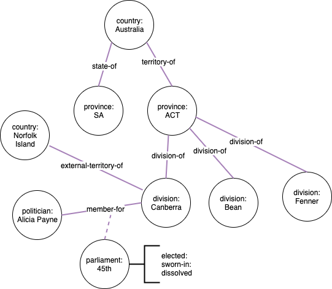

# Parliament Types, Edges

	

## Vertices

1. Parliaments (/)
2. Electorates (by Province) - urn:aec.gov.au:division:{name} (/)
3. Senate Seats (Numbered per state, territory e.g. AU-QLD-1) (/)
4. Parliamentarians (People)
5. Parties
6. Lobbying Organisation (/)
7. Lobbying Clients (/)
8. AEC Transparency Register - Party Returns, Funding https://www.aec.gov.au/Parties_and_Representatives/financial_disclosure/transparency-register/

## Edges

1. Electorates to Locations.provinces (/)
2. Countries to Electorates (External territories of Australia)  (/)
3. Parliamentarians to Electorates (by Parliament ID)
4. Parliamentarians to Parties (Effective date)
5. Parliamentarians to Senate seats (Effective Date)
6. Cabinet to Parliamentarians (by Parliament ID, Date)
7. Parliamentarian to Parliament Role ( by Parliament ID, date, roleName) e.g. Speaker, Prime Minister, Opposition Leader,..
8. Parliamentarian to Party (Date)
9. Postcodes to States
10. Postcodes to Electorates

# Data Guidance

## Senate Seats

`urn:aph.gov.au:senateseat:{PROVINCE}_[0,9]{2}`

`urn:aph.gov.au:senateseat:NSW_01`

Definition:
https://en.wikipedia.org/wiki/Australian_Senate#Size_and_nexus

1901 - 6 Senators for each state, 36 seats
1948 - 10 Senators for each state, 60 seats
1975 - 2 for each territory, 64 Seats
1984 - 12 Senators for each state, 2 for each territory - 76 seats

## Postcodes

`urn:australiapost.com.au:postcode:[0-9](1,5)_[A-Z,a-z,0-9]*`
`urn:australiapost.com.au:postcode:5603_VERRAN`

https://en.wikipedia.org/wiki/Postcodes_in_Australia

There in the source are some postcodes thate are overloaded, the data source has multiple place names in the
list and the geographical area / boundary can vary for that entry.

Cleansing steps:

*Add New Column URN:*
CONCATENATE(urn:australiapost.com.au:postcode:,C2,SUBSTITUTE(D2," ","",))

*Add New Column province:*
CONCATENATE("urn:iso:std:iso:3166:-2:AU-",F2)

*Search / Replace on status, to 'lastUpdate'*

Convert dates to ISO YYYY-MM-DD standard `2020-02-06`
Rename column to lastUpdate

Source:
https://www.matthewproctor.com/australian_postcodes
https://www.matthewproctor.com/Content/postcodes/australian_postcodes.csv

## Political Parties

aec.gov.au

Based on all Parties that have won seats between 2001, 2020 elections as first priority.

AEC JSON Parties

https://www.aec.gov.au/Parties_and_Representatives/Party_Registration/Registered_parties/files/register-2021-02-12.json

### HOR 46th Parliament (2001 - 2020)

1 Australian Greens
68 Australian Labor Party
1 Centre Alliance
3 Independent
1 Katter's Australian Party
23 Liberal National Party of Queensland
44 Liberal Party of Australia
10 The Nationals

### Senate 46th Parliament

9 Australian Greens
26 Australian Labor Party
1 Centre Alliance
1 Country Liberal Party
1 Independent
1 Jacqui Lambie Network
31 Liberal Party of Australia
2 Pauline Hanson's One Nation
4 The Nationals

### Minor parties 2001-2020

Hinch's Justice
Australian Conservatives
Liberal Democrat
United Australia Party
Conservative National - Fraser Anning
Nick Xenophon Team
Palmer United Party
Family First Party
Australian Motoring Enthusiast Party
Democratic Labour Party
Australian Sports Party
Xenophon Group
Australian Democrats

## Branches
State Branches
